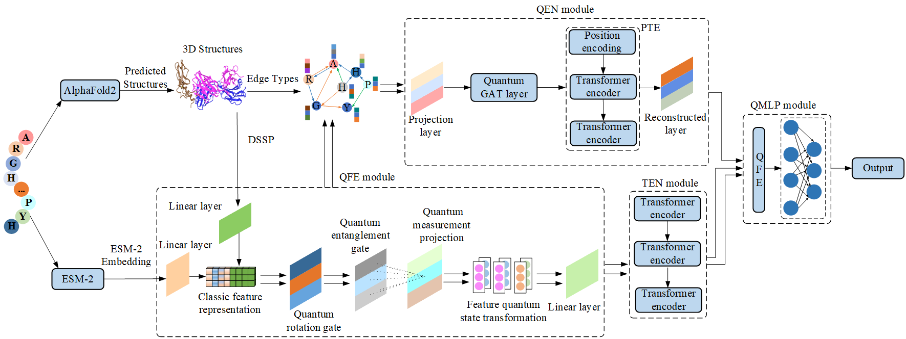

# Intro
QGraphTad is the first model to incorporate core principles of quantum cognition into B-cell epitope prediction tasks, utilizing richer high-dimensional quantum state-encoded features and undergoing simulated quantum operations, including rotation, entanglement, and measurement projection, to simulate the structural polymorphism and global interactions of proteins, thereby enhancing feature expression and attention modeling capabilities. A quantum-enhanced network employing a multi-head attention mechanism based on quantum entanglement and dense graphs, integrated with modules similar to visual transformers to capture complex structural dependencies. Conformation-based B-cell epitope prediction is achieved through a quantum multi-layer perceptron.


# System requirement
QGraphTad is developed under Linux environment with:
- 1 python 3.9.12
- 2 numpy 1.24.3
- 3 pandas 2.1.4
- 4 fair-esm 2.0.1
- 5 torch 1.12.1
- 6 pytorch-lightning 1.6.4
- 7 (optional) esmfold

# Software requirement
To run the full & accurate version of GraphBepi, you need to make sure the following software is in the [mkdssp](./mkdssp) directory:  
[DSSP](https://github.com/cmbi/dssp) (*dssp ver 2.0.4* is Already in this repository) 
# Build dataset
1. `git clone https://github.com/Smile-King/QGraphTad.git && cd QGraphTad`
2. `python dataset.py --gpu 0`

It will take about 20 minutes to download the pretrained ESM-2 model and an hour to build our dataset with CUDA.

# Run QGraphTad for training
After building our dataset ***BCE_633***, train the model with default hyper params:
```
python train.py --dataset BCE_633
```
# Run QGraphTad for prediction
1) Please execute the following command directly if you can provide the PDB file.
2) If you want to skip the training steps, you can go to [Google Drive](https://drive.google.com/drive/folders/1qDq-3L1CfKLnBFCD5_d05HYcpW6c-CzW?usp=sharing)download our pre-trained model files and replace the model folder in the current folder to proceed directly to the testing steps.
3) If you do not have a PDB file, you can use [AlphaFold2](http://bio-web1.nscc-gz.cn/app/alphaFold2_bio) to predict the protein structure. 

```
python test.py -i pdb_file -p --gpu 0 -o ./output
```

or

use a faster structural prediction model [ESMFold](https://github.com/facebookresearch/esm) in our project, so you can process the sequences directly by following the commands below.

```
python test.py -i fasta_file -f --gpu 0 -o ./output
```
